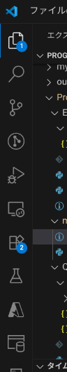
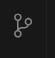
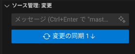
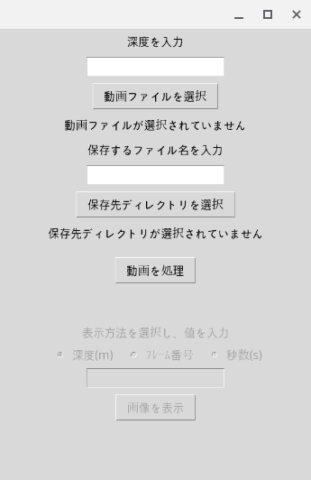

# れどみだよ。読んでね。

# 前提条件
pythonとgitがインストールしてあり、実行できる状態

あとできればエディタはvscode

また沈む速度が大体一定の映像のみ対応
# 必要なライブラリとそのインストールコマンド
## OpenCV
pip install opencv-python
## NumPy
pip install numpy
## Matplotlib
pip install matplotlib
## Tkinter[^1]
[^1]: （Python標準ライブラリなので通常は不要、Ubuntuの場合は以下でインストール）

sudo apt-get install python3-tk

# アプリの使い方
## 導入方法
作業ディレクトリに移動して、

``` shell :クローン
git clone https://github.com/kuronos357/marine-object-counter.git
```
と入れ、実行すると導入は完了します

## 更新方法

1. リモートの更新を取得
```
git fetch origin
```
リモートにある新しいコミット情報をローカルに持ってきます。
※まだファイルは上書きされません。

2. ローカルブランチに反映
```
git pull origin main
```
origin/main の更新を、自分の作業中の main ブランチに統合します。
（merge または rebase の形で適用）

またここからはvscode限定ですが、一応GUIベースの方法も載せます。
vscodeの左上にこういうアイコンたちがあると思います。



その中の、



このアイコンを選択してください。

更新があれば、`ソース管理・変更`のところにこのような表示がされていると思います。



そうしたら、説明通りに更新のボタンを押下してください。

## データ入力
コードを実行すると、ウィンドウが出てくると思います。



まあ、説明のとおりに

- 深度
- 動画ファイルパス
- 保存先ファイルパス
- ファイル名

を入力して、「動画を処理」ボタンを押してください

## 出力
処理が終わると、グラフが出てきます。また同時にで先程入力した保存先のファイルパスにCSVファイルが入っているはずです。これの読み方は後述します。

また、「表示方法を選択し値を入力」という場所が使用できるようになっているはずです。ここに深度やフレーム番号、秒数を指定することでそのフレームの画像が出てきます。グラフはカーソルを合わせると詳しいデータがポップアップされるのでこれを見て気になる部分があった場合にその場所の画像を見ることができます。

### グラフ
白いピクセルの割合を縦軸、深度を横軸にとってあります。

## 出力ファイルの読み方

| 列名         | 内容説明                       |
|--------------|-------------------------------|
| Number       | 行番号                      |
| Threshold    | 白と黒の閾値（列すべて同じ値なんて意味があるのかだって？知らんな。）                  |
| Interval    | 何秒おきに切り取ったかの値（列すべて同じ(ry)） |
| Frame        |処理した画像が何フレーム目かの値             |
| （事前に入力したファイル名）|肝心の値。処理が終わったときに出てくるグラフは、これを縦軸、Numberを横軸にとってある（はず）             |

## 出力ファイルの使い方
(事前に入力したファイル名)の行をコピーして、他の深度のデータもある親ファイルに新規の行として貼り付けると
行番号がそのまま震度と比例してるから（１行５ｍとかだった気がする）そのまま比較できる。


## 食べさせるファイルの注意点
・画面の、ライトが海を照らして明るくなっているす全ての範囲のみ動画にしてください。（間にポールがあったりするとまずい）

・明るいところ飲み切り抜いてもまずい

・ポールとか餌があったりした場合は、その部分を切り取って別の光量が同じくらいの場所から映像を持ってきて、過不足なくライトで照らされている範囲の動画に編集してください。

・[前例集](https://drive.google.com/drive/folders/1S4Y21baL3YAeLcbYG05tcdIBCin6q1vk?usp=sharing)意外とあとから参照したりするんで、食べさせたファイルはここなんかに保存しておいたほうがいいです。
# 大まかな仕組み
1. 動画ファイルの選択
TkinterのGUIで動画ファイルを選択します。

2. 保存先ディレクトリ・ファイル名・深度の入力
保存先ディレクトリ、CSVファイル名、深度（分析する区間数）を入力します。

3. 動画の総フレーム数を取得
count_total_frames関数で動画の総フレーム数を取得します。

4. フレーム抽出間隔の計算
入力された深度とscale値から、何フレームごとに画像を抽出するか（interval）を計算します。

5. フレーム抽出
extract_frames関数で、intervalごとにフレームを抽出します。

6. フレームの処理
抽出した各フレームをグレースケール化し、指定した閾値で二値化します（binarize_frame）。

7. 白いピクセルの割合計算
二値化画像の白いピクセルの割合を計算します（calculate_white_ratio）。

8. 結果の可視化
白いピクセルの割合をグラフで表示します（plot_ratios）。

9. CSV保存
各フレームごとの白いピクセル割合などの情報をCSVファイルとして保存します（save_ratios_to_csv）。

情報の流れまとめ
ユーザー入力（動画・保存先・深度・ファイル名）
動画→フレーム抽出→画像処理→割合計算
グラフ表示・CSV保存
この流れで、動画内の白いピクセルの割合（＝浮遊物の概算）を区間ごとに算出・記録します。

# 主要な変数説明

| 変数名        | 役割・説明                                               |
|---------------|---------------------------------------------------------|
| scale         | フレーム抽出の細かさを決める係数(行/m)                        |
| threshold     | 二値化処理の際の閾値                                     |
| trim          | 白ピクセル数の計算時に加算する値（微調整用）             |
| video_path    | 処理対象の動画ファイルのパス                             |
| total_frames  | 動画の総フレーム数                                       |
| interval      | 何フレームごとに画像を抽出するかの間隔                   |
| frames        | 抽出したフレーム画像のリスト                             |
| white_ratios  | 各フレームごとの白いピクセルの割合（浮遊物の概算値）リスト|
| save_path     | CSVファイルの保存先ディレクトリ                          |
| filename      | 保存するCSVファイル名                                    |
| depth_label   | 深度（分析区間数）                                     |


# 要望・質問・問題等
[ここ](https://github.com/kuronos357/marine-object-counter/issues/new)からissueの報告を頼みます。
コードの改変も歓迎です。ブランチを作ってpushしてください
